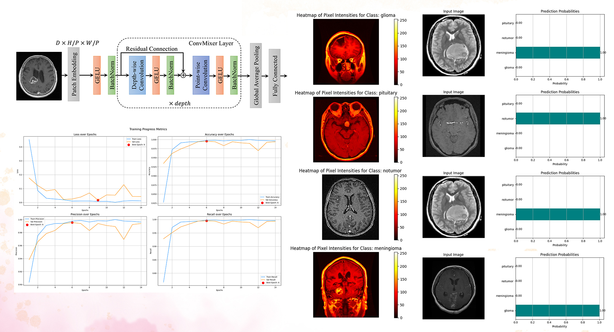
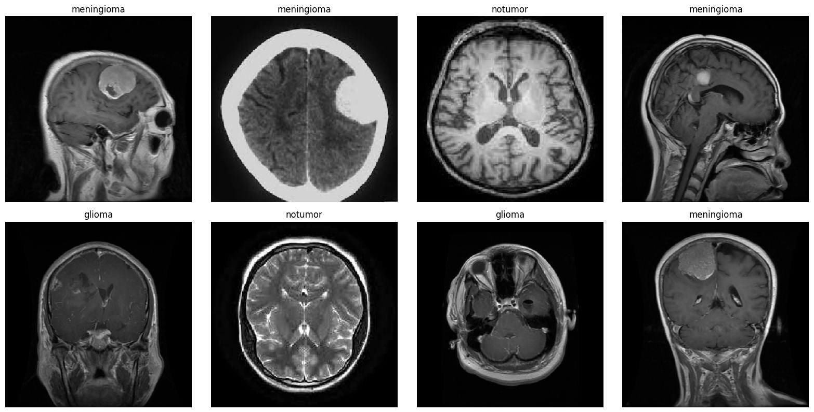
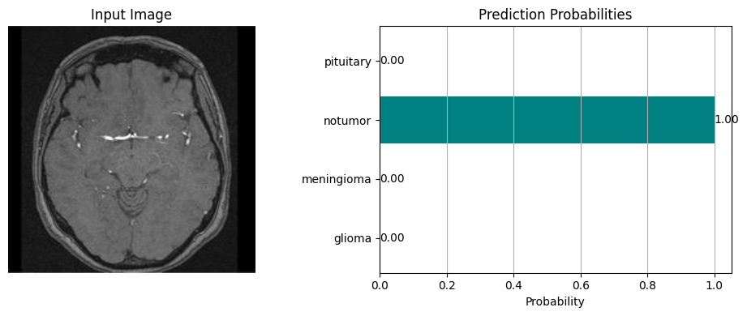
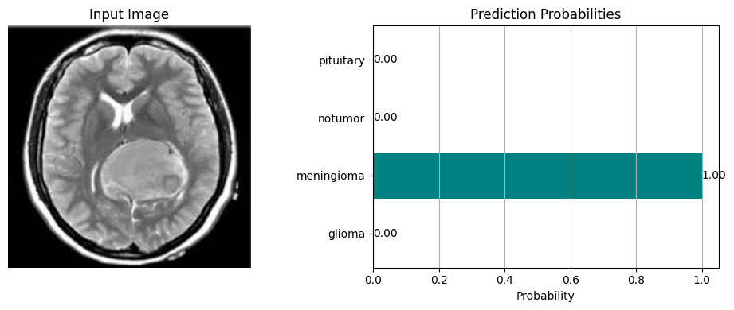
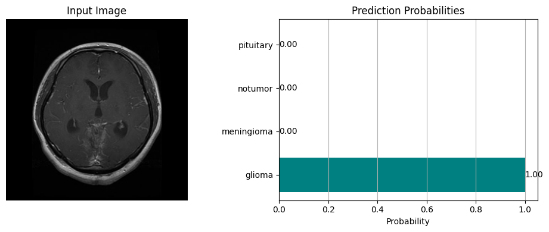

# Optimized MRI Brain Tumor Classification Using Transfer Learning with Xception Architecture
<p align="center">  </p>
Brain tumors such as gliomas, meningiomas, and pituitary tumors can be life-threatening and require timely, accurate diagnosis. With advances in medical imaging
and AI, deep learning models now aid radiologists and clinicians by providing fast, automated assessments. This project leverages transfer learning with the Xception model to classify brain tumors using MRI scans.
<br> This application integrates a pre-trained deep learning model with a patient-friendly Streamlit interface to collect metadata, assess symptoms, classify tumor types, and generate PDF reports with optional OpenAI-based medical recommendations.

## Public Accessibility:
[https://mrimodelclnew.streamlit.app/](https://mrimodelclnew.streamlit.app/)

## Dataset
<p align="center">  </p>
The Xception model was fine-tuned using a public brain MRI dataset that includes four major tumor classes:

- Glioma
- Meningioma
- Pituitary
- No tumor
- Visualization of t-SNE embeddings

Source on Kaggle:
[Brain Tumor MRI Datasett](https://www.kaggle.com/datasets/masoudnickparvar/brain-tumor-mri-dataset/data)

## Project Overview
The workflow includes:

- Streamlit-based UI for patient intake and file upload
- Symptom questionnaire form
- Xception model prediction on uploaded MRI scan
- Confidence-level visualization with bar plot
- OpenAI integration for a personalized medical recommendation
- PDF report generation and download

## Model Training Configuration

- Model: Xception (ImageNet weights, fine-tuned)
- Input Size: 299x299 pixels
- Epochs: 50
- Batch Size: 32
- Optimizer: Adam
- Loss: Categorical Crossentropy

| Section           | Description                         | Suggested Visual           |
| ----------------- | ----------------------------------- | -------------------------- |
| Patient Intake    | Form for name, age, gender, history | Patient form UI         |
| Symptom Form      | 10-question radio button survey     | Form UI screenshot      |
| Image Upload      | Accepts .jpg/.png MRI scans         | Sample MRI preview      |
| Model Prediction  | Predicts tumor class                | Horizontal bar chart (probability)|
| Report Generation | Detailed report with all info       | Generated PDF example   |
| GPT-Based Advice  | AI-powered medical suggestion       | Text output from OpenAI |

## Output Examples
<p align="center">  </p>
<p align="center">  </p>
<p align="center">  </p>

## Installation and Usage
To run the model, ensure you have the necessary dependencies installed:
```sh
pip install streamlit tensorflow numpy pandas pillow matplotlib gdown reportlab openai
```
To run the app
```sh
streamlit run Main.py
```

## Conclusion
This tool shows the feasibility of combining transfer learning, clinical input forms, and language model reasoning for improved tumor screening workflows. It can support radiologists in both early screening and patient counselling.


## License
**Copyright (c) 2025 Abdullah Elafifi**
